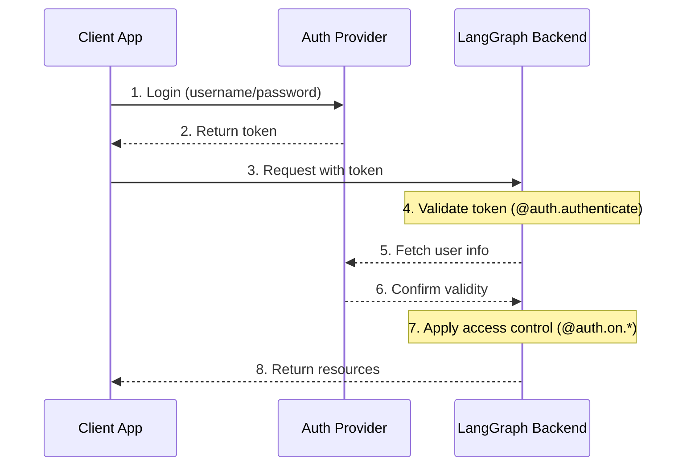
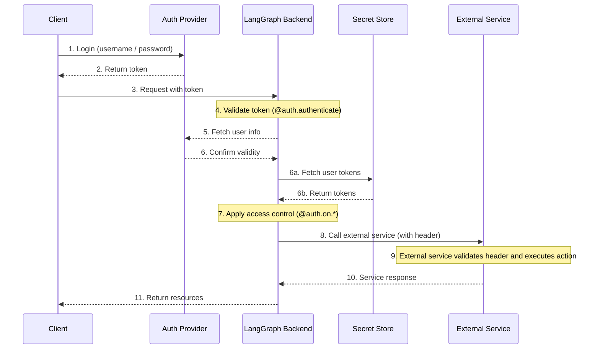

---
search:
  boost: 2
---

# 인증 및 액세스 제어

LangGraph Platform은 대부분의 인증 체계와 통합할 수 있는 유연한 인증 및 권한 부여 시스템을 제공합니다.

## 핵심 개념

### 인증 vs 권한 부여

종종 혼용되지만, 이 용어들은 서로 다른 보안 개념을 나타냅니다:

- [**인증**](#authentication) ("AuthN")은 _당신이 누구인지_를 확인합니다. 이는 모든 요청에 대해 미들웨어로 실행됩니다.
- [**권한 부여**](#authorization) ("AuthZ")는 _당신이 무엇을 할 수 있는지_를 결정합니다. 이는 리소스별로 사용자의 권한과 역할을 검증합니다.

:::python
LangGraph Platform에서 인증은 [`@auth.authenticate`](../cloud/reference/sdk/python_sdk_ref.md#langgraph_sdk.auth.Auth.authenticate) 핸들러로 처리되고, 권한 부여는 [`@auth.on`](../cloud/reference/sdk/python_sdk_ref.md#langgraph_sdk.auth.Auth.on) 핸들러로 처리됩니다.
:::

:::js
LangGraph Platform에서 인증은 [`@auth.authenticate`](../cloud/reference/sdk/typescript_sdk_ref.md#auth.authenticate) 핸들러로 처리되고, 권한 부여는 [`@auth.on`](../cloud/reference/sdk/typescript_sdk_ref.md#auth.on) 핸들러로 처리됩니다.
:::

## 기본 보안 모델

LangGraph Platform은 다양한 보안 기본값을 제공합니다:

### LangGraph Platform

- 기본적으로 LangSmith API 키를 사용합니다
- `x-api-key` 헤더에 유효한 API 키가 필요합니다
- 인증 핸들러로 사용자 정의할 수 있습니다

!!! note "사용자 정의 인증"

   사용자 정의 인증은 LangGraph Platform의 모든 플랜에서 **지원됩니다**.

### Self-Hosted

- 기본 인증이 없습니다
- 보안 모델을 구현할 완전한 유연성을 제공합니다
- 인증 및 권한 부여의 모든 측면을 제어합니다

## 시스템 아키텍처

일반적인 인증 설정에는 세 가지 주요 구성 요소가 포함됩니다:

1. **인증 제공자** (Identity Provider/IdP)

   - 사용자 신원과 자격 증명을 관리하는 전용 서비스
   - 사용자 등록, 로그인, 비밀번호 재설정 등을 처리합니다
   - 인증 성공 후 토큰(JWT, 세션 토큰 등)을 발급합니다
   - 예시: Auth0, Supabase Auth, Okta 또는 자체 인증 서버

2. **LangGraph 백엔드** (Resource Server)

   - 비즈니스 로직과 보호된 리소스를 포함하는 LangGraph 애플리케이션
   - 인증 제공자와 함께 토큰을 검증합니다
   - 사용자 신원 및 권한에 따라 액세스 제어를 적용합니다
   - 사용자 자격 증명을 직접 저장하지 않습니다

3. **클라이언트 애플리케이션** (Frontend)

   - 웹 앱, 모바일 앱 또는 API 클라이언트
   - 시간에 민감한 사용자 자격 증명을 수집하여 인증 제공자에게 보냅니다
   - 인증 제공자로부터 토큰을 받습니다
   - 이러한 토큰을 LangGraph 백엔드에 대한 요청에 포함합니다

이러한 구성 요소가 일반적으로 상호 작용하는 방식은 다음과 같습니다:



:::python
LangGraph의 [`@auth.authenticate`](../cloud/reference/sdk/python_sdk_ref.md#langgraph_sdk.auth.Auth.authenticate) 핸들러는 4-6단계를 처리하고, [`@auth.on`](../cloud/reference/sdk/python_sdk_ref.md#langgraph_sdk.auth.Auth.on) 핸들러는 7단계를 구현합니다.
:::

:::js
LangGraph의 [`auth.authenticate`](https://langchain-ai.github.io/langgraph/cloud/reference/sdk/js_ts_sdk_ref/#authenticate) 핸들러는 4-6단계를 처리하고, [`auth.on`](https://langchain-ai.github.io/langgraph/cloud/reference/sdk/js_ts_sdk_ref/#on>) 핸들러는 7단계를 구현합니다.
:::

## 인증 {#authentication}

:::python
LangGraph의 인증은 모든 요청에 대해 미들웨어로 실행됩니다. [`@auth.authenticate`](../cloud/reference/sdk/python_sdk_ref.md#langgraph_sdk.auth.Auth.authenticate) 핸들러는 요청 정보를 받아 다음을 수행해야 합니다:

1. 자격 증명 검증
2. 유효한 경우 사용자의 신원과 사용자 정보를 포함하는 [사용자 정보](../cloud/reference/sdk/python_sdk_ref.md#langgraph_sdk.auth.types.MinimalUserDict) 반환
3. 유효하지 않은 경우 [HTTPException](../cloud/reference/sdk/python_sdk_ref.md#langgraph_sdk.auth.exceptions.HTTPException) 또는 AssertionError 발생

```python
from langgraph_sdk import Auth

auth = Auth()

@auth.authenticate
async def authenticate(headers: dict) -> Auth.types.MinimalUserDict:
    # Validate credentials (e.g., API key, JWT token)
    api_key = headers.get("x-api-key")
    if not api_key or not is_valid_key(api_key):
        raise Auth.exceptions.HTTPException(
            status_code=401,
            detail="Invalid API key"
        )

    # Return user info - only identity and is_authenticated are required
    # Add any additional fields you need for authorization
    return {
        "identity": "user-123",        # Required: unique user identifier
        "is_authenticated": True,      # Optional: assumed True by default
        "permissions": ["read", "write"] # Optional: for permission-based auth
        # You can add more custom fields if you want to implement other auth patterns
        "role": "admin",
        "org_id": "org-456"

    }
```

The returned user information is available:

- To your authorization handlers via [`ctx.user`](../cloud/reference/sdk/python_sdk_ref.md#langgraph_sdk.auth.types.AuthContext)
- In your application via `config["configuration"]["langgraph_auth_user"]`
  :::

:::js
Authentication in LangGraph runs as middleware on every request. Your [`authenticate`](https://langchain-ai.github.io/langgraph/cloud/reference/sdk/js_ts_sdk_ref/#authenticate>) handler receives request information and should:

1. Validate the credentials
2. Return user information containing the user's identity and user information if valid
3. Raise an [HTTPException](https://langchain-ai.github.io/langgraph/cloud/reference/sdk/js_ts_sdk_ref/#class-httpexception>) if invalid

```typescript
import { Auth, HTTPException } from "@langchain/langgraph-sdk";

export const auth = new Auth();

auth.authenticate(async (request) => {
  // Validate credentials (e.g., API key, JWT token)
  const apiKey = request.headers.get("x-api-key");
  if (!apiKey || !isValidKey(apiKey)) {
    throw new HTTPException(401, "Invalid API key");
  }

  // Return user info - only identity and isAuthenticated are required
  // Add any additional fields you need for authorization
  return {
    identity: "user-123", // Required: unique user identifier
    isAuthenticated: true, // Optional: assumed true by default
    permissions: ["read", "write"], // Optional: for permission-based auth
    // You can add more custom fields if you want to implement other auth patterns
    role: "admin",
    orgId: "org-456",
  };
});
```

The returned user information is available:

- To your authorization handlers via the `user` property in a [callback handler](https://langchain-ai.github.io/langgraph/cloud/reference/sdk/js_ts_sdk_ref/#on)
- In your application via `config.configurable.langgraph_auth_user`
  :::

??? tip "Supported Parameters"

    :::python
    The [`@auth.authenticate`](../cloud/reference/sdk/python_sdk_ref.md#langgraph_sdk.auth.Auth.authenticate) handler can accept any of the following parameters by name:

    * request (Request): The raw ASGI request object
    * body (dict): The parsed request body
    * path (str): The request path, e.g., "/threads/abcd-1234-abcd-1234/runs/abcd-1234-abcd-1234/stream"
    * method (str): The HTTP method, e.g., "GET"
    * path_params (dict[str, str]): URL path parameters, e.g., {"thread_id": "abcd-1234-abcd-1234", "run_id": "abcd-1234-abcd-1234"}
    * query_params (dict[str, str]): URL query parameters, e.g., {"stream": "true"}
    * headers (dict[bytes, bytes]): Request headers
    * authorization (str | None): The Authorization header value (e.g., "Bearer <token>")
    :::

    :::js
    The [`authenticate`](https://langchain-ai.github.io/langgraph/cloud/reference/sdk/js_ts_sdk_ref/#authenticate) handler can accept any of the following parameters:

    * request (Request): The raw request object
    * body (object): The parsed request body
    * path (string): The request path, e.g., "/threads/abcd-1234-abcd-1234/runs/abcd-1234-abcd-1234/stream"
    * method (string): The HTTP method, e.g., "GET"
    * pathParams (Record<string, string>): URL path parameters, e.g., {"threadId": "abcd-1234-abcd-1234", "runId": "abcd-1234-abcd-1234"}
    * queryParams (Record<string, string>): URL query parameters, e.g., {"stream": "true"}
    * headers (Record<string, string>): Request headers
    * authorization (string | null): The Authorization header value (e.g., "Bearer <token>")
    :::

    In many of our tutorials, we will just show the "authorization" parameter to be concise, but you can opt to accept more information as needed
    to implement your custom authentication scheme.

### 에이전트 인증

사용자 정의 인증은 위임된 액세스를 허용합니다. `@auth.authenticate`에서 반환하는 값은 실행 컨텍스트에 추가되어 에이전트에게 사용자 범위 자격 증명을 제공하여 사용자를 대신하여 리소스에 액세스할 수 있게 합니다.



After authentication, the platform creates a special configuration object that is passed to your graph and all nodes via the configurable context.
This object contains information about the current user, including any custom fields you return from your [`@auth.authenticate`](../cloud/reference/sdk/python_sdk_ref.md#langgraph_sdk.auth.Auth.authenticate) handler.

To enable an agent to act on behalf of the user, use [custom authentication middleware](../how-tos/auth/custom_auth.md). This will allow the agent to interact with external systems like MCP servers, external databases, and even other agents on behalf of the user.

For more information, see the [Use custom auth](../how-tos/auth/custom_auth.md#enable-agent-authentication) guide.

### MCP를 사용한 에이전트 인증

MCP 서버에 에이전트를 인증하는 방법에 대한 정보는 [MCP 개념 가이드](../concepts/mcp.md)를 참조하세요.

## 권한 부여 {#authorization}

인증 후 LangGraph는 권한 부여 핸들러를 호출하여 특정 리소스(예: threads, assistants, crons)에 대한 액세스를 제어합니다. 이러한 핸들러는 다음을 수행할 수 있습니다:

1. 메타데이터를 변경하여 리소스 생성 중에 저장할 메타데이터를 추가합니다. 각 작업에 대해 값이 가질 수 있는 유형 목록은 [지원되는 작업 테이블](#supported-actions)을 참조하세요.
2. 검색/목록 또는 읽기 작업 중에 [필터](#filter-operations)를 반환하여 메타데이터별로 리소스를 필터링합니다.
3. 액세스가 거부된 경우 HTTP 예외를 발생시킵니다.

If you want to just implement simple user-scoped access control, you can use a single authorization handler for all resources and actions. If you want to have different control depending on the resource and action, you can use [resource-specific handlers](#resource-specific-handlers). See the [Supported Resources](#supported-resources) section for a full list of the resources that support access control.

:::python
Your [`@auth.on`](../cloud/reference/sdk/python_sdk_ref.md#langgraph_sdk.auth.Auth.on) handlers control access by mutating the `value["metadata"]` dictionary directly and returning a [filter dictionary](#filter-operations).

```python
@auth.on
async def add_owner(
    ctx: Auth.types.AuthContext,
    value: dict  # The payload being sent to this access method
) -> dict:  # Returns a filter dict that restricts access to resources
    """Authorize all access to threads, runs, crons, and assistants.

    This handler does two things:
        - Adds a value to resource metadata (to persist with the resource so it can be filtered later)
        - Returns a filter (to restrict access to existing resources)

    Args:
        ctx: Authentication context containing user info, permissions, the path, and
        value: The request payload sent to the endpoint. For creation
              operations, this contains the resource parameters. For read
              operations, this contains the resource being accessed.

    Returns:
        A filter dictionary that LangGraph uses to restrict access to resources.
        See [Filter Operations](#filter-operations) for supported operators.
    """
    # Create filter to restrict access to just this user's resources
    filters = {"owner": ctx.user.identity}

    # Get or create the metadata dictionary in the payload
    # This is where we store persistent info about the resource
    metadata = value.setdefault("metadata", {})

    # Add owner to metadata - if this is a create or update operation,
    # this information will be saved with the resource
    # So we can filter by it later in read operations
    metadata.update(filters)

    # Return filters to restrict access
    # These filters are applied to ALL operations (create, read, update, search, etc.)
    # to ensure users can only access their own resources
    return filters
```

:::

:::js
You can granularly control access by mutating the `value.metadata` object directly and returning a [filter object](#filter-operations) when registering an [`on()`](https://langchain-ai.github.io/langgraph/cloud/reference/sdk/js_ts_sdk_ref/#on) handler.

```typescript
import { Auth, HTTPException } from "@langchain/langgraph-sdk/auth";

export const auth = new Auth()
  .authenticate(async (request: Request) => ({
    identity: "user-123",
    permissions: [],
  }))
  .on("*", ({ value, user }) => {
    // Create filter to restrict access to just this user's resources
    const filters = { owner: user.identity };

    // If the operation supports metadata, add the user identity
    // as metadata to the resource.
    if ("metadata" in value) {
      value.metadata ??= {};
      value.metadata.owner = user.identity;
    }

    // Return filters to restrict access
    // These filters are applied to ALL operations (create, read, update, search, etc.)
    // to ensure users can only access their own resources
    return filters;
  });
```

:::

### 리소스별 핸들러 {#resource-specific-handlers}

You can register handlers for specific resources and actions by chaining the resource and action names together with the authorization decorator.
When a request is made, the most specific handler that matches that resource and action is called. Below is an example of how to register handlers for specific resources and actions. For the following setup:

1. Authenticated users are able to create threads, read threads, and create runs on threads
2. Only users with the "assistants:create" permission are allowed to create new assistants
3. All other endpoints (e.g., e.g., delete assistant, crons, store) are disabled for all users.

!!! tip "Supported Handlers"

    For a full list of supported resources and actions, see the [Supported Resources](#supported-resources) section below.

:::python

```python
# Generic / global handler catches calls that aren't handled by more specific handlers
@auth.on
async def reject_unhandled_requests(ctx: Auth.types.AuthContext, value: Any) -> False:
    print(f"Request to {ctx.path} by {ctx.user.identity}")
    raise Auth.exceptions.HTTPException(
        status_code=403,
        detail="Forbidden"
    )

# Matches the "thread" resource and all actions - create, read, update, delete, search
# Since this is **more specific** than the generic @auth.on handler, it will take precedence
# over the generic handler for all actions on the "threads" resource
@auth.on.threads
async def on_thread_create(
    ctx: Auth.types.AuthContext,
    value: Auth.types.threads.create.value
):
    if "write" not in ctx.permissions:
        raise Auth.exceptions.HTTPException(
            status_code=403,
            detail="User lacks the required permissions."
        )
    # Setting metadata on the thread being created
    # will ensure that the resource contains an "owner" field
    # Then any time a user tries to access this thread or runs within the thread,
    # we can filter by owner
    metadata = value.setdefault("metadata", {})
    metadata["owner"] = ctx.user.identity
    return {"owner": ctx.user.identity}

# Thread creation. This will match only on thread create actions
# Since this is **more specific** than both the generic @auth.on handler and the @auth.on.threads handler,
# it will take precedence for any "create" actions on the "threads" resources
@auth.on.threads.create
async def on_thread_create(
    ctx: Auth.types.AuthContext,
    value: Auth.types.threads.create.value
):
    # Setting metadata on the thread being created
    # will ensure that the resource contains an "owner" field
    # Then any time a user tries to access this thread or runs within the thread,
    # we can filter by owner
    metadata = value.setdefault("metadata", {})
    metadata["owner"] = ctx.user.identity
    return {"owner": ctx.user.identity}

# Reading a thread. Since this is also more specific than the generic @auth.on handler, and the @auth.on.threads handler,
# it will take precedence for any "read" actions on the "threads" resource
@auth.on.threads.read
async def on_thread_read(
    ctx: Auth.types.AuthContext,
    value: Auth.types.threads.read.value
):
    # Since we are reading (and not creating) a thread,
    # we don't need to set metadata. We just need to
    # return a filter to ensure users can only see their own threads
    return {"owner": ctx.user.identity}

# Run creation, streaming, updates, etc.
# This takes precedenceover the generic @auth.on handler and the @auth.on.threads handler
@auth.on.threads.create_run
async def on_run_create(
    ctx: Auth.types.AuthContext,
    value: Auth.types.threads.create_run.value
):
    metadata = value.setdefault("metadata", {})
    metadata["owner"] = ctx.user.identity
    # Inherit thread's access control
    return {"owner": ctx.user.identity}

# Assistant creation
@auth.on.assistants.create
async def on_assistant_create(
    ctx: Auth.types.AuthContext,
    value: Auth.types.assistants.create.value
):
    if "assistants:create" not in ctx.permissions:
        raise Auth.exceptions.HTTPException(
            status_code=403,
            detail="User lacks the required permissions."
        )
```

:::

:::js

```typescript
import { Auth, HTTPException } from "@langchain/langgraph-sdk/auth";

export const auth = new Auth()
  .authenticate(async (request: Request) => ({
    identity: "user-123",
    permissions: ["threads:write", "threads:read"],
  }))
  .on("*", ({ event, user }) => {
    console.log(`Request for ${event} by ${user.identity}`);
    throw new HTTPException(403, { message: "Forbidden" });
  })

  // Matches the "threads" resource and all actions - create, read, update, delete, search
  // Since this is **more specific** than the generic `on("*")` handler, it will take precedence over the generic handler for all actions on the "threads" resource
  .on("threads", ({ permissions, value, user }) => {
    if (!permissions.includes("write")) {
      throw new HTTPException(403, {
        message: "User lacks the required permissions.",
      });
    }

    // Not all events do include `metadata` property in `value`.
    // So we need to add this type guard.
    if ("metadata" in value) {
      value.metadata ??= {};
      value.metadata.owner = user.identity;
    }

    return { owner: user.identity };
  })

  // Thread creation. This will match only on thread create actions.
  // Since this is **more specific** than both the generic `on("*")` handler and the `on("threads")` handler, it will take precedence for any "create" actions on the "threads" resources
  .on("threads:create", ({ value, user, permissions }) => {
    if (!permissions.includes("write")) {
      throw new HTTPException(403, {
        message: "User lacks the required permissions.",
      });
    }

    // Setting metadata on the thread being created will ensure that the resource contains an "owner" field
    // Then any time a user tries to access this thread or runs within the thread,
    // we can filter by owner
    value.metadata ??= {};
    value.metadata.owner = user.identity;

    return { owner: user.identity };
  })

  // Reading a thread. Since this is also more specific than the generic `on("*")` handler, and the `on("threads")` handler,
  .on("threads:read", ({ user }) => {
    // Since we are reading (and not creating) a thread,
    // we don't need to set metadata. We just need to
    // return a filter to ensure users can only see their own threads.
    return { owner: user.identity };
  })

  // Run creation, streaming, updates, etc.
  // This takes precedence over the generic `on("*")` handler and the `on("threads")` handler
  .on("threads:create_run", ({ value, user }) => {
    value.metadata ??= {};
    value.metadata.owner = user.identity;

    return { owner: user.identity };
  })

  // Assistant creation. This will match only on assistant create actions.
  // Since this is **more specific** than both the generic `on("*")` handler and the `on("assistants")` handler, it will take precedence for any "create" actions on the "assistants" resources
  .on("assistants:create", ({ value, user, permissions }) => {
    if (!permissions.includes("assistants:create")) {
      throw new HTTPException(403, {
        message: "User lacks the required permissions.",
      });
    }

    // Setting metadata on the assistant being created will ensure that the resource contains an "owner" field.
    // Then any time a user tries to access this assistant, we can filter by owner
    value.metadata ??= {};
    value.metadata.owner = user.identity;

    return { owner: user.identity };
  });
```

:::

Notice that we are mixing global and resource-specific handlers in the above example. Since each request is handled by the most specific handler, a request to create a `thread` would match the `on_thread_create` handler but NOT the `reject_unhandled_requests` handler. A request to `update` a thread, however would be handled by the global handler, since we don't have a more specific handler for that resource and action.

### 필터 작업 {#filter-operations}

:::python
Authorization handlers can return different types of values:

- `None` and `True` mean "authorize access to all underling resources"
- `False` means "deny access to all underling resources (raises a 403 exception)"
- A metadata filter dictionary will restrict access to resources

A filter dictionary is a dictionary with keys that match the resource metadata. It supports three operators:

- The default value is a shorthand for exact match, or "$eq", below. For example, `{"owner": user_id}` will include only resources with metadata containing `{"owner": user_id}`
- `$eq`: Exact match (e.g., `{"owner": {"$eq": user_id}}`) - this is equivalent to the shorthand above, `{"owner": user_id}`
- `$contains`: List membership (e.g., `{"allowed_users": {"$contains": user_id}}`) The value here must be an element of the list. The metadata in the stored resource must be a list/container type.

A dictionary with multiple keys is treated using a logical `AND` filter. For example, `{"owner": org_id, "allowed_users": {"$contains": user_id}}` will only match resources with metadata whose "owner" is `org_id` and whose "allowed_users" list contains `user_id`.
See the reference [here](../cloud/reference/sdk/python_sdk_ref.md#langgraph_sdk.auth.types.FilterType) for more information.
:::

:::js
Authorization handlers can return different types of values:

- `null` and `true` mean "authorize access to all underling resources"
- `false` means "deny access to all underling resources (raises a 403 exception)"
- A metadata filter object will restrict access to resources

A filter object is an object with keys that match the resource metadata. It supports three operators:

- The default value is a shorthand for exact match, or "$eq", below. For example, `{ owner: userId}` will include only resources with metadata containing `{ owner: userId }`
- `$eq`: Exact match (e.g., `{ owner: { $eq: userId } }`) - this is equivalent to the shorthand above, `{ owner: userId }`
- `$contains`: List membership (e.g., `{ allowedUsers: { $contains: userId} }`) The value here must be an element of the list. The metadata in the stored resource must be a list/container type.

An object with multiple keys is treated using a logical `AND` filter. For example, `{ owner: orgId, allowedUsers: { $contains: userId} }` will only match resources with metadata whose "owner" is `orgId` and whose "allowedUsers" list contains `userId`.
See the reference [here](../cloud/reference/sdk/typescript_sdk_ref.md#auth.types.FilterType) for more information.
:::

## 일반적인 액세스 패턴

다음은 일반적인 권한 부여 패턴입니다:

### 단일 소유자 리소스 {#single-owner-resources}

이 일반적인 패턴을 사용하면 모든 threads, assistants, crons 및 runs의 범위를 단일 사용자로 지정할 수 있습니다. 일반 챗봇 스타일 앱과 같은 일반적인 단일 사용자 사용 사례에 유용합니다.

:::python

```python
@auth.on
async def owner_only(ctx: Auth.types.AuthContext, value: dict):
    metadata = value.setdefault("metadata", {})
    metadata["owner"] = ctx.user.identity
    return {"owner": ctx.user.identity}
```

:::

:::js

```typescript
export const auth = new Auth()
  .authenticate(async (request: Request) => ({
    identity: "user-123",
    permissions: ["threads:write", "threads:read"],
  }))
  .on("*", ({ value, user }) => {
    if ("metadata" in value) {
      value.metadata ??= {};
      value.metadata.owner = user.identity;
    }
    return { owner: user.identity };
  });
```

:::

### 권한 기반 액세스

이 패턴을 사용하면 **권한**을 기반으로 액세스를 제어할 수 있습니다. 특정 역할이 리소스에 대해 더 광범위하거나 더 제한적인 액세스 권한을 갖도록 하려는 경우 유용합니다.

:::python

```python
# In your auth handler:
@auth.authenticate
async def authenticate(headers: dict) -> Auth.types.MinimalUserDict:
    ...
    return {
        "identity": "user-123",
        "is_authenticated": True,
        "permissions": ["threads:write", "threads:read"]  # Define permissions in auth
    }

def _default(ctx: Auth.types.AuthContext, value: dict):
    metadata = value.setdefault("metadata", {})
    metadata["owner"] = ctx.user.identity
    return {"owner": ctx.user.identity}

@auth.on.threads.create
async def create_thread(ctx: Auth.types.AuthContext, value: dict):
    if "threads:write" not in ctx.permissions:
        raise Auth.exceptions.HTTPException(
            status_code=403,
            detail="Unauthorized"
        )
    return _default(ctx, value)


@auth.on.threads.read
async def rbac_create(ctx: Auth.types.AuthContext, value: dict):
    if "threads:read" not in ctx.permissions and "threads:write" not in ctx.permissions:
        raise Auth.exceptions.HTTPException(
            status_code=403,
            detail="Unauthorized"
        )
    return _default(ctx, value)
```

:::

:::js

```typescript
import { Auth, HTTPException } from "@langchain/langgraph-sdk/auth";

export const auth = new Auth()
  .authenticate(async (request: Request) => ({
    identity: "user-123",
    // Define permissions in auth
    permissions: ["threads:write", "threads:read"],
  }))
  .on("threads:create", ({ value, user, permissions }) => {
    if (!permissions.includes("threads:write")) {
      throw new HTTPException(403, { message: "Unauthorized" });
    }

    if ("metadata" in value) {
      value.metadata ??= {};
      value.metadata.owner = user.identity;
    }
    return { owner: user.identity };
  })
  .on("threads:read", ({ user, permissions }) => {
    if (
      !permissions.includes("threads:read") &&
      !permissions.includes("threads:write")
    ) {
      throw new HTTPException(403, { message: "Unauthorized" });
    }

    return { owner: user.identity };
  });
```

:::

## 지원되는 리소스 {#supported-resources}

LangGraph는 가장 일반적인 것부터 가장 구체적인 것까지 세 가지 수준의 권한 부여 핸들러를 제공합니다:

:::python

1. **Global Handler** (`@auth.on`): Matches all resources and actions
2. **Resource Handler** (e.g., `@auth.on.threads`, `@auth.on.assistants`, `@auth.on.crons`): Matches all actions for a specific resource
3. **Action Handler** (e.g., `@auth.on.threads.create`, `@auth.on.threads.read`): Matches a specific action on a specific resource

The most specific matching handler will be used. For example, `@auth.on.threads.create` takes precedence over `@auth.on.threads` for thread creation.
If a more specific handler is registered, the more general handler will not be called for that resource and action.
:::

:::js

1. **Global Handler** (`on("*")`): Matches all resources and actions
2. **Resource Handler** (e.g., `on("threads")`, `on("assistants")`, `on("crons")`): Matches all actions for a specific resource
3. **Action Handler** (e.g., `on("threads:create")`, `on("threads:read")`): Matches a specific action on a specific resource

The most specific matching handler will be used. For example, `on("threads:create")` takes precedence over `on("threads")` for thread creation.
If a more specific handler is registered, the more general handler will not be called for that resource and action.
:::

:::python
???+ tip "Type Safety"
Each handler has type hints available for its `value` parameter. For example:

    ```python
    @auth.on.threads.create
    async def on_thread_create(
        ctx: Auth.types.AuthContext,
        value: Auth.types.on.threads.create.value  # Specific type for thread creation
    ):
        ...

    @auth.on.threads
    async def on_threads(
        ctx: Auth.types.AuthContext,
        value: Auth.types.on.threads.value  # Union type of all thread actions
    ):
        ...

    @auth.on
    async def on_all(
        ctx: Auth.types.AuthContext,
        value: dict  # Union type of all possible actions
    ):
        ...
    ```

    More specific handlers provide better type hints since they handle fewer action types.

:::

#### Supported actions and types {#supported-actions}

Here are all the supported action handlers:

:::python
| Resource | Handler | Description | Value Type |
|----------|---------|-------------|------------|
| **Threads** | `@auth.on.threads.create` | Thread creation | [`ThreadsCreate`](../cloud/reference/sdk/python_sdk_ref.md#langgraph_sdk.auth.types.ThreadsCreate) |
| | `@auth.on.threads.read` | Thread retrieval | [`ThreadsRead`](../cloud/reference/sdk/python_sdk_ref.md#langgraph_sdk.auth.types.ThreadsRead) |
| | `@auth.on.threads.update` | Thread updates | [`ThreadsUpdate`](../cloud/reference/sdk/python_sdk_ref.md#langgraph_sdk.auth.types.ThreadsUpdate) |
| | `@auth.on.threads.delete` | Thread deletion | [`ThreadsDelete`](../cloud/reference/sdk/python_sdk_ref.md#langgraph_sdk.auth.types.ThreadsDelete) |
| | `@auth.on.threads.search` | Listing threads | [`ThreadsSearch`](../cloud/reference/sdk/python_sdk_ref.md#langgraph_sdk.auth.types.ThreadsSearch) |
| | `@auth.on.threads.create_run` | Creating or updating a run | [`RunsCreate`](../cloud/reference/sdk/python_sdk_ref.md#langgraph_sdk.auth.types.RunsCreate) |
| **Assistants** | `@auth.on.assistants.create` | Assistant creation | [`AssistantsCreate`](../cloud/reference/sdk/python_sdk_ref.md#langgraph_sdk.auth.types.AssistantsCreate) |
| | `@auth.on.assistants.read` | Assistant retrieval | [`AssistantsRead`](../cloud/reference/sdk/python_sdk_ref.md#langgraph_sdk.auth.types.AssistantsRead) |
| | `@auth.on.assistants.update` | Assistant updates | [`AssistantsUpdate`](../cloud/reference/sdk/python_sdk_ref.md#langgraph_sdk.auth.types.AssistantsUpdate) |
| | `@auth.on.assistants.delete` | Assistant deletion | [`AssistantsDelete`](../cloud/reference/sdk/python_sdk_ref.md#langgraph_sdk.auth.types.AssistantsDelete) |
| | `@auth.on.assistants.search` | Listing assistants | [`AssistantsSearch`](../cloud/reference/sdk/python_sdk_ref.md#langgraph_sdk.auth.types.AssistantsSearch) |
| **Crons** | `@auth.on.crons.create` | Cron job creation | [`CronsCreate`](../cloud/reference/sdk/python_sdk_ref.md#langgraph_sdk.auth.types.CronsCreate) |
| | `@auth.on.crons.read` | Cron job retrieval | [`CronsRead`](../cloud/reference/sdk/python_sdk_ref.md#langgraph_sdk.auth.types.CronsRead) |
| | `@auth.on.crons.update` | Cron job updates | [`CronsUpdate`](../cloud/reference/sdk/python_sdk_ref.md#langgraph_sdk.auth.types.CronsUpdate) |
| | `@auth.on.crons.delete` | Cron job deletion | [`CronsDelete`](../cloud/reference/sdk/python_sdk_ref.md#langgraph_sdk.auth.types.CronsDelete) |
| | `@auth.on.crons.search` | Listing cron jobs | [`CronsSearch`](../cloud/reference/sdk/python_sdk_ref.md#langgraph_sdk.auth.types.CronsSearch) |
:::

:::js
| Resource | Event | Description | Value Type |
| -------------- | -------------------- | -------------------------- | ------------------------------------------------------------------------------------------------------------------ |
| **Threads** | `threads:create` | Thread creation | [`ThreadsCreate`](https://langchain-ai.github.io/langgraph/cloud/reference/sdk/js_ts_sdk_ref/#threadscreate) |
| | `threads:read` | Thread retrieval | [`ThreadsRead`](https://langchain-ai.github.io/langgraph/cloud/reference/sdk/js_ts_sdk_ref/#threadsread) |
| | `threads:update` | Thread updates | [`ThreadsUpdate`](https://langchain-ai.github.io/langgraph/cloud/reference/sdk/js_ts_sdk_ref/#threadsupdate) |
| | `threads:delete` | Thread deletion | [`ThreadsDelete`](https://langchain-ai.github.io/langgraph/cloud/reference/sdk/js_ts_sdk_ref/#threadsdelete) |
| | `threads:search` | Listing threads | [`ThreadsSearch`](https://langchain-ai.github.io/langgraph/cloud/reference/sdk/js_ts_sdk_ref/#threadssearch) |
| | `threads:create_run` | Creating or updating a run | [`RunsCreate`](https://langchain-ai.github.io/langgraph/cloud/reference/sdk/js_ts_sdk_ref/#threadscreate_run) |
| **Assistants** | `assistants:create` | Assistant creation | [`AssistantsCreate`](https://langchain-ai.github.io/langgraph/cloud/reference/sdk/js_ts_sdk_ref/#assistantscreate) |
| | `assistants:read` | Assistant retrieval | [`AssistantsRead`](https://langchain-ai.github.io/langgraph/cloud/reference/sdk/js_ts_sdk_ref/#assistantsread) |
| | `assistants:update` | Assistant updates | [`AssistantsUpdate`](https://langchain-ai.github.io/langgraph/cloud/reference/sdk/js_ts_sdk_ref/#assistantsupdate) |
| | `assistants:delete` | Assistant deletion | [`AssistantsDelete`](https://langchain-ai.github.io/langgraph/cloud/reference/sdk/js_ts_sdk_ref/#assistantsdelete) |
| | `assistants:search` | Listing assistants | [`AssistantsSearch`](https://langchain-ai.github.io/langgraph/cloud/reference/sdk/js_ts_sdk_ref/#assistantssearch) |
| **Crons** | `crons:create` | Cron job creation | [`CronsCreate`](https://langchain-ai.github.io/langgraph/cloud/reference/sdk/js_ts_sdk_ref/#cronscreate) |
| | `crons:read` | Cron job retrieval | [`CronsRead`](https://langchain-ai.github.io/langgraph/cloud/reference/sdk/js_ts_sdk_ref/#cronsread) |
| | `crons:update` | Cron job updates | [`CronsUpdate`](https://langchain-ai.github.io/langgraph/cloud/reference/sdk/js_ts_sdk_ref/#cronsupdate) |
| | `crons:delete` | Cron job deletion | [`CronsDelete`](https://langchain-ai.github.io/langgraph/cloud/reference/sdk/js_ts_sdk_ref/#cronsdelete) |
| | `crons:search` | Listing cron jobs | [`CronsSearch`](https://langchain-ai.github.io/langgraph/cloud/reference/sdk/js_ts_sdk_ref/#cronssearch) |
:::

???+ note "About Runs"

    Runs are scoped to their parent thread for access control. This means permissions are typically inherited from the thread, reflecting the conversational nature of the data model. All run operations (reading, listing) except creation are controlled by the thread's handlers.

    :::python
    There is a specific `create_run` handler for creating new runs because it had more arguments that you can view in the handler.
    :::

    :::js
    There is a specific `threads:create_run` handler for creating new runs because it had more arguments that you can view in the handler.
    :::

## 다음 단계

구현 세부 사항은 다음을 참조하세요:

- [인증 설정](../tutorials/auth/getting_started.md)에 대한 소개 튜토리얼을 확인하세요
- [사용자 정의 인증 핸들러](../how-tos/auth/custom_auth.md) 구현에 대한 how-to 가이드를 참조하세요
